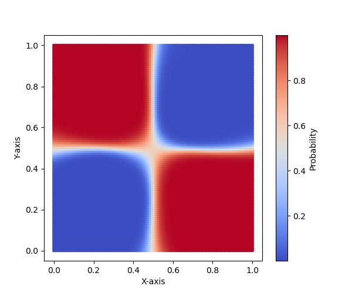

# Numpy_Neural_Network

Простая нейросеть для решения задачи классификации, написанная только с использованием NumPy.

## Реализовано:
* Линейный слой (Linear)
* ReLU
* Сигмоида (Sigmoid)

## Требования:
* numpy
* matplotlib (для визуализации)